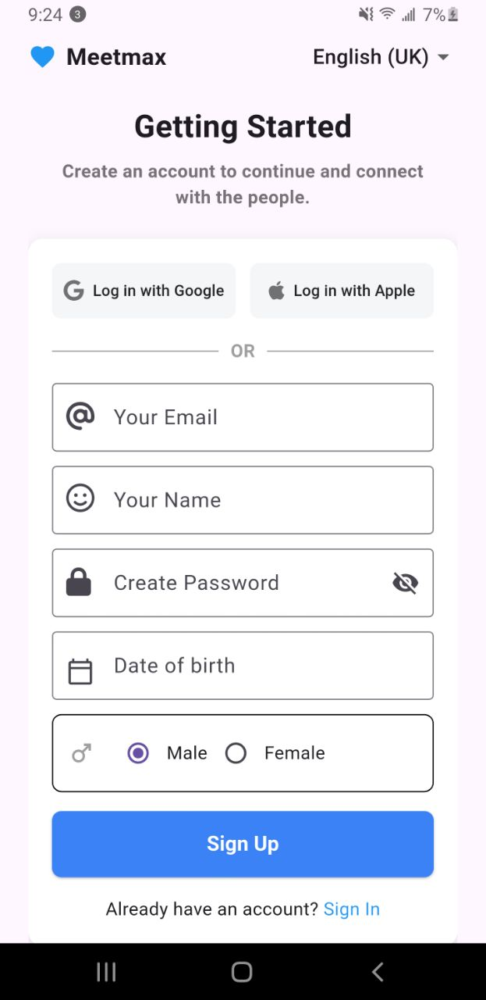
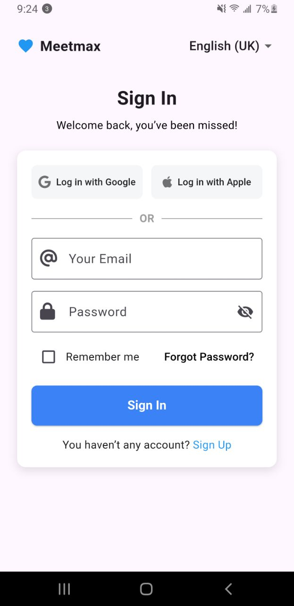
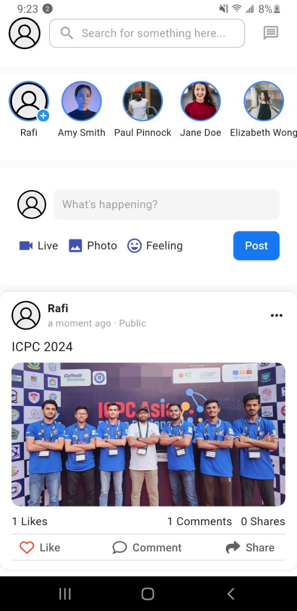
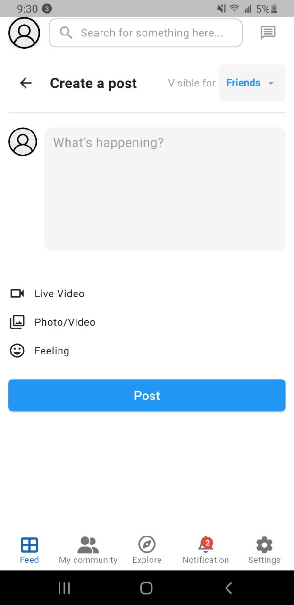
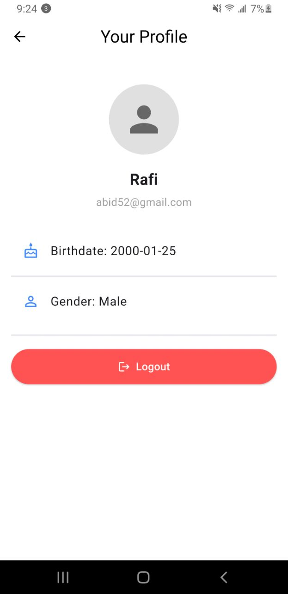
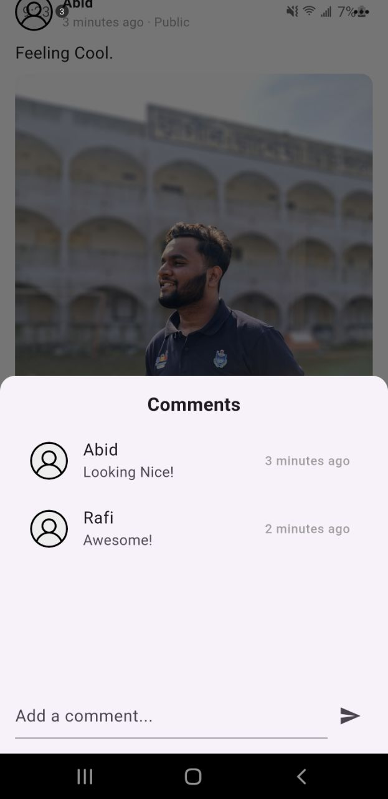

# Meetmax

Meetmax is a Facebook-style social media app built using Flutter and Dart, designed to provide a clean and responsive user experience for posting content, commenting, and engaging with others. Local storage is implemented using Hive instead of Firebase.

---

## 🔧 How to Set Up, Run, and Test the Application

### ✅ Prerequisites
- Flutter SDK installed
- Dart installed
- Compatible editor like **Android Studio**

## 🛠 Setup Instructions

### ✅ 1. Clone the Repository using Android Studio

#### Option A: Using Android Studio Interface

1. Open **Android Studio**.
2. Click on **File > New > Project from Version Control** (or choose **"Get from Version Control"** from the welcome screen).
3. In the URL field, paste:
   ```
   https://github.com/AbiDHussen/Meetmax.git
   ```
4. Choose your local directory and click **Clone**.
5. Wait for the project to sync and finish indexing.

#### Option B: Using Command Line

```bash
git clone https://github.com/AbiDHussen/Meetmax.git
cd Meetmax
```

---

### ✅ 2. Install Dependencies

In Android Studio:
- Open the terminal (bottom tab) and run:
  ```bash
  flutter pub get
  ```

This will fetch all the required packages listed in `pubspec.yaml`.

---

### ✅ 3. Run the App

Ensure an emulator is running or a device is connected, then:

```bash
flutter run
```

> 📦 On first launch, the app will auto-seed dummy users, stories, posts, and comments into Hive local storage for testing.

---

### ⚙️ Optional: Generate Hive Type Adapters (Only if Errors Occur)

If you see errors related to missing `.g.dart` files or Hive type adapters:

```bash
flutter pub run build_runner build --delete-conflicting-outputs
```

This will generate the necessary files for `User`, `Post`, `Comment`, etc.

---

## 📁 Folder Structure

```
lib/
│
├── data/                       # Static app data or mock datasets
├── dummyModels/               # Mock data models
├── models/                    # Actual data models (User, Post, Comment)
├── screens/                   # All screen-level UI
│   ├── create_post_screen.dart
│   ├── current_user_profile_info.dart
│   ├── feed_screen.dart
│   ├── forgot_password_screen.dart
│   ├── login_screen.dart
│   └── signup_screen.dart
├── services/                  # Business logic layer
│   ├── auth_service.dart
│   ├── post_service.dart
│   └── user_service.dart
├── widgets/                   # Reusable UI components
│   ├── createPost/
│   ├── customButtonAndTextfield/
│   └── feed/
├── debug_helper.dart          # Debugging utilities
├── main.dart                  # Entry point
```

---

## 🛠 Tools & Technologies Used

- **Flutter**
- **Dart**
- **Hive** for local storage
- **FontAwesome** and **Material Icons** for UI

---

## ✨ Features

- ✅ Login and registration with proper validation and authentication
- ✅ Feed screen displaying all posts
- ✅ Create post functionality (supports text and image)
- ✅ Like and comment on posts in real time
- ✅ User profile page with basic info(tap the left corner avatar button to go to profile page)

---

## 🖼 Screenshots

| Signup Screen                            | Sign In Screen                          |
|------------------------------------------|-----------------------------------------|
|  |  |

| Forgot Password                                  | Feed Screen                              |
|--------------------------------------------------|------------------------------------------|
|  |  |

| Create Post                                  | Profile Screen                             |
|----------------------------------------------|--------------------------------------------|
|  |  |

| Comments Section                             |
|----------------------------------------------|
|  |


---

## 📄 Assumptions & Simulated Backend

- **Authentication & user management** are handled locally using `Hive`.
- No real backend/API – post/comment interactions are stored in local storage.
- Image uploading is simulated using file picker or device image selection.
- User sessions are preserved using local box storage.
- ⚠️ **Likes and comments will not work on dummy posts. They only function on real posts created by the user.**


---
